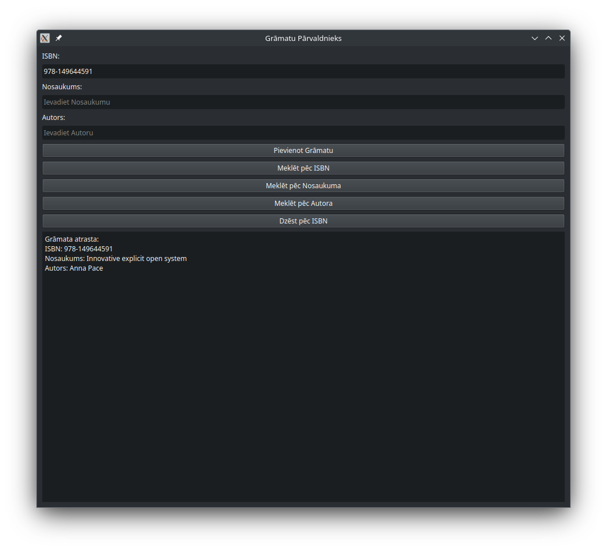

## Risinājums

`gen-books.py` satur skriptu, kas izveido `books.json` failu ar realistiskiem datiem.

`main.py` ielasa `books.json` failu un ļauj lietotājam veikt operācijas ar grāmatām.

Lietotājsaskarne:

## Uzdevums

Uzdevums: Izstrādāt grāmatnīcas inventāra pārvaldības sistēmu Python programmēšanas valodā.

Prasības:
- Datu struktūra:
    - Inventāra saraksts tiek glabāts kā Python vārdnīca.
        - Lai nebūtu dati jāievada katru reizi no jauna, programmā var "iekodēt" sākotnējo grāmatu sarakstu.
    - Par katru grāmatu tiek glabāta vismaz šāda informācija: title, author, ISBN, price un quantity in stock.
    - Katras grāmatas informācija tiek glabāta atsevišķā vārdnīcā
    - Inventāra saraksta vārdnīcas atslēgas ir ISBN kodi un tās vērtības ir vārdnīcas ar informāciju par grāmatu.

- Funkcionalitāte:
    - Pievienot grāmatu:
        - Lietotājam ir jādod iespēja sarakstam pievienot jaunu grāmatu.
        - Pievienojot grāmatu, pārliecinieties, ka tās ISBN numurs ir unikāls. Ja šāds ISBN numurs jau ir sarakstā, attēlot kļūdas ziņojumu.
    - Meklēšana pēc ISBN:
        - Lietotājiem ir jāļauj meklēt grāmatu pēc tās ISBN numura.
        - Ja grāmata tika atrasta, attēlot informāciju par to.
        - Ja grāmata netika atrasta, attēlot kļūdas ziņojumu.
    - Meklēšana pēc nosaukuma vai autora:
        - Ļaut lietotājiem meklēt grāmatu pēc vārda tās nosaukuma vai autora laukā. Rezultātā attēlot sarakstu ar grāmatām, kas atbilst meklēšanas kritērijiem.
    - Grāmatu saraksts:
        - Attēlot sarakstu ar visām grāmatām, par katru grāmatu parādot šādu informāciju: title, author, ISBN, quantity in stock.
    - Dzēst grāmatu:
        - Izdzēst no saraksta grāmatu ar doto ISBN numuru.
        - Informēt lietotāju, ka grāmata tika veiksmīgi izdzēsta, vai arī, ka ISBN numurs netika atrasts.

Lietotāja saskarne

Lai iegūtu vērtējumu 8, pietiek realizēt vienkāršu teksta saskarni.

Lai iegūtu augstāku vērtējumu, izstrādājiet programmu ar grafisko lietotāja saskarni (izmantojot tādas Python bibliotēkas kā Tkinter, PyQt vai PySide). Var izmantot arī bibliotēku "rich", kas ļauj veidot "advanced" teksta formāta saskarni.

Iesniegšana: Iesniedziet arhīvu ar Python programmas pirmkodu, kas realizē prasīto funkcionalitāti. Programmas kodam ir jābūt pienācīgi dokumentētam (ar komentāriem un jēgpilniem mainīgo nosaukumiem).

Ja programmā tiek pielietotas ārējās bibliotēkas, iekļaujiet arhīvā failu requirements.txt, kurš satur šo bibliotēku nosaukumus un versiju numurus.
